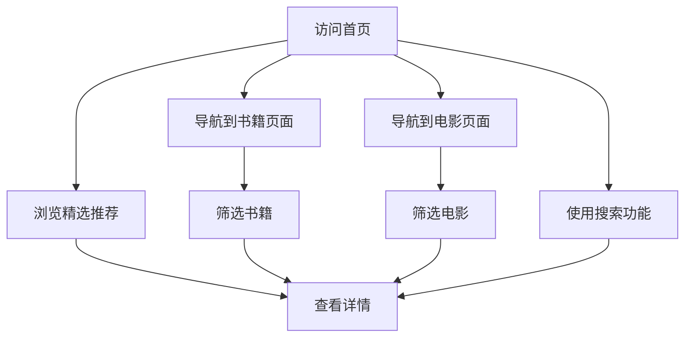

# 产品需求文档 (PRD)

## 1. 产品概述
这是一个个人内容分享网站，主要用于分享书籍和电影的推荐、评论和心得。网站将采用 Astro 框架构建，部署到 GitHub Pages，提供美观的内容展示和良好的用户体验。

- 主要目的：为书籍和电影爱好者提供一个分享和发现优质内容的平台
- 目标用户：书籍和电影爱好者、内容创作者、个人博客用户
- 产品价值：通过精美的界面设计和优质的内容分享，建立个人品牌，吸引志同道合的读者

## 2. 核心功能

### 2.1 用户角色
本项目为个人网站，无需用户注册系统，所有内容由站长管理。

### 2.2 功能模块
1. **首页**：展示最新和精选的书籍/电影推荐
2. **书籍页面**：书籍列表、分类筛选、详情展示
3. **电影页面**：电影列表、分类筛选、详情展示
4. **关于页面**：个人介绍、联系方式、网站说明
5. **搜索功能**：全文搜索书籍和电影内容

### 2.3 页面详情
| 页面名称 | 模块名称 | 功能描述 |
|---------|---------|---------|
| 首页 | 精选推荐 | 展示3-6个精选书籍/电影，带动画效果 |
| 首页 | 最新内容 | 展示最近添加的书籍和电影 |
| 首页 | 分类导航 | 快速跳转到书籍或电影分类 |
| 书籍页面 | 筛选栏 | 按类型、评分、年份等筛选书籍 |
| 书籍页面 | 卡片列表 | 展示书籍封面、标题、作者、评分、简介 |
| 书籍页面 | 详情弹窗 | 点击卡片显示详细评论和推荐理由 |
| 电影页面 | 筛选栏 | 按类型、评分、年份、导演等筛选电影 |
| 电影页面 | 卡片列表 | 展示电影海报、标题、导演、评分、简介 |
| 电影页面 | 详情弹窗 | 点击卡片显示详细评论和推荐理由 |
| 关于页面 | 个人介绍 | 头像、简介、兴趣爱好 |
| 关于页面 | 联系方式 | 社交媒体链接、邮箱地址 |
| 全局 | 搜索栏 | 支持标题、作者、导演、标签的模糊搜索 |

## 3. 核心流程
用户访问网站后，可以通过以下流程发现内容：

1. 首页浏览精选推荐，点击感兴趣的内容查看详情
2. 通过导航栏进入书籍或电影专区
3. 使用筛选功能缩小查找范围
4. 点击卡片查看详细评论和推荐理由
5. 使用搜索功能快速定位特定内容

## 4. 用户界面设计

### 4.1 设计风格
- **主色调**：深棕色 (#8B4513) + 米白色 (#FFF8DC)，营造温馨的阅读氛围
- **辅助色**：深灰色 (#333333) 用于文字，浅灰色 (#F5F5F5) 用于背景
- **按钮风格**：圆角按钮，悬停时有轻微阴影和颜色变化
- **字体选择**：标题使用衬线字体（如 Noto Serif SC），正文使用无衬线字体（如 Noto Sans SC）
- **布局风格**：卡片式布局，顶部导航，响应式设计
- **图标风格**：使用简洁的线条图标，配合书籍和电影相关的 emoji

### 4.2 页面设计概览
| 页面名称 | 模块名称 | UI 元素 |
|---------|---------|--------|
| 首页 | 精选推荐 | 大尺寸卡片，渐变背景，悬停放大效果 |
| 首页 | 最新内容 | 水平滚动卡片，自动播放动画 |
| 书籍页面 | 卡片列表 | 网格布局，封面图片，星级评分组件 |
| 电影页面 | 卡片列表 | 网格布局，海报图片，星级评分组件 |
| 详情页 | 内容区域 | 模态框或独立页面，丰富的排版 |

### 4.3 响应式设计
- 桌面端优先设计，适配平板和移动端
- 移动端：单列布局，触摸友好的按钮尺寸
- 平板端：双列布局，保持良好的可读性
- 桌面端：三列或四列网格布局，充分利用屏幕空间

### 4.4 动画效果
- 页面加载时的渐入动画
- 卡片悬停时的缩放和阴影效果
- 筛选时的平滑过渡动画
- 滚动时的视差效果（可选）