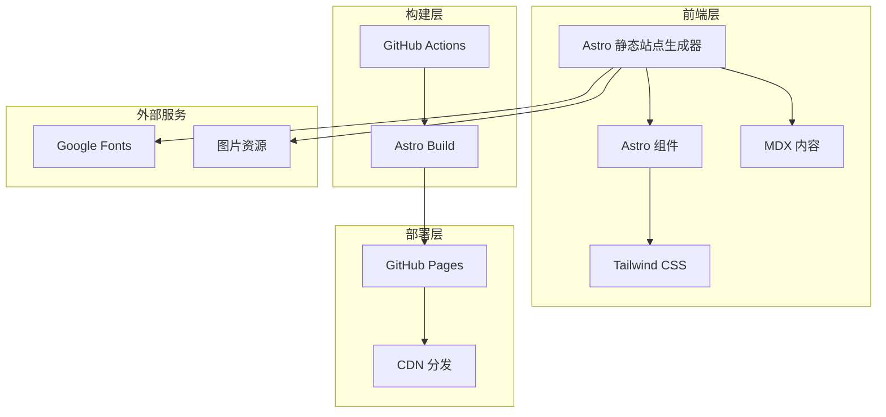

# 技术架构文档

## 1. 架构设计



## 2. 技术描述

- **前端框架**：Astro@4.x - 静态站点生成器，支持多框架组件
- **UI 框架**：原生 Astro 组件 + Tailwind CSS@3.x
- **内容管理**：Astro Content Collections + MDX
- **构建工具**：Vite（Astro 内置）
- **包管理器**：npm
- **部署平台**：GitHub Pages
- **CI/CD**：GitHub Actions

## 3. 路由定义

| 路由 | 用途 | 页面类型 |
|------|------|----------|
| `/` | 首页，展示精选推荐和最新内容 | 静态页面 |
| `/books` | 书籍列表页面，支持筛选和搜索 | 静态页面 |
| `/books/[slug]` | 书籍详情页面 | 静态页面 |
| `/movies` | 电影列表页面，支持筛选和搜索 | 静态页面 |
| `/movies/[slug]` | 电影详情页面 | 静态页面 |
| `/about` | 关于页面 | 静态页面 |
| `/search` | 搜索结果页面 | 静态页面 |

## 4. 项目结构

```
src/
├── components/          # 可复用组件
│   ├── Header.astro     # 顶部导航栏
│   ├── Footer.astro     # 底部信息栏
│   ├── Card.astro       # 内容卡片组件
│   ├── Filter.astro     # 筛选组件
│   ├── Search.astro     # 搜索组件
│   └── StarRating.astro # 星级评分组件
├── content/             # 内容集合
│   ├── books/           # 书籍内容（MDX）
│   └── movies/          # 电影内容（MDX）
├── layouts/             # 布局组件
│   └── Layout.astro     # 主布局
├── pages/               # 页面路由
│   ├── index.astro      # 首页
│   ├── books/
│   │   ├── index.astro  # 书籍列表
│   │   └── [slug].astro # 书籍详情
│   ├── movies/
│   │   ├── index.astro  # 电影列表
│   │   └── [slug].astro # 电影详情
│   ├── about.astro      # 关于页面
│   └── search.astro     # 搜索页面
├── styles/              # 全局样式
│   └── global.css       # 全局 CSS
├── utils/               # 工具函数
│   └── search.js        # 搜索功能
└── assets/              # 静态资源
    ├── images/          # 图片资源
    └── fonts/           # 字体文件
```

## 5. 数据模型

### 5.1 书籍数据模型
```typescript
interface Book {
  title: string;           // 书籍标题
  author: string;          // 作者
  cover: string;           // 封面图片路径
  rating: number;          // 评分 (1-5)
  genre: string[];         // 类型标签
  year: number;            // 出版年份
  publisher: string;       // 出版社
  isbn: string;            // ISBN
  pages: number;           // 页数
  description: string;     // 简介
  review: string;          // 详细评论
  featured: boolean;       // 是否精选
  createdAt: Date;         // 创建时间
}
```

### 5.2 电影数据模型
```typescript
interface Movie {
  title: string;           // 电影标题
  director: string;        // 导演
  poster: string;          // 海报图片路径
  rating: number;          // 评分 (1-5)
  genre: string[];         // 类型标签
  year: number;            // 上映年份
  duration: number;        // 时长（分钟）
  cast: string[];          // 主演
  country: string;         // 国家/地区
  description: string;     // 简介
  review: string;          // 详细评论
  featured: boolean;       // 是否精选
  createdAt: Date;         // 创建时间
}
```

## 6. 组件设计

### 6.1 核心组件

**Layout.astro** - 主布局组件
- 包含 HTML 头部、导航栏、页脚
- 接收页面标题和描述作为 props
- 集成全局样式和字体

**Card.astro** - 内容卡片组件
- 显示封面/海报、标题、评分、简介
- 支持书籍和电影两种模式
- 包含悬停动画效果

**Filter.astro** - 筛选组件
- 按类型、评分、年份筛选
- 支持多选和清除筛选
- 响应式设计

**Search.astro** - 搜索组件
- 实时搜索建议
- 支持标题、作者、导演、标签搜索
- 搜索结果高亮

**StarRating.astro** - 星级评分组件
- 显示1-5星评分
- 支持半星显示
- 可配置大小和颜色

### 6.2 页面组件

**index.astro** - 首页
- Hero 区域展示精选推荐
- 最新内容滚动展示
- 分类导航卡片

**books/index.astro** - 书籍列表
- 筛选栏
- 网格布局的书籍卡片
- 分页或无限滚动

**movies/index.astro** - 电影列表
- 筛选栏
- 网格布局的电影卡片
- 分页或无限滚动

## 7. 样式方案

### 7.1 Tailwind CSS 配置
```javascript
// tailwind.config.mjs
export default {
  content: ['./src/**/*.{astro,html,js,jsx,md,mdx,svelte,ts,tsx,vue}'],
  theme: {
    extend: {
      colors: {
        primary: {
          50: '#fdf8f0',
          100: '#f8edd8',
          200: '#f0d9b0',
          300: '#e5c080',
          400: '#d9a050',
          500: '#8B4513',
          600: '#7a3c10',
          700: '#69330d',
          800: '#582a0b',
          900: '#472108',
        },
        cream: '#FFF8DC',
        dark: '#333333',
        light: '#F5F5F5',
      },
      fontFamily: {
        serif: ['Noto Serif SC', 'serif'],
        sans: ['Noto Sans SC', 'sans-serif'],
      },
    },
  },
  plugins: [],
}
```

### 7.2 全局样式
```css
/* src/styles/global.css */
@tailwind base;
@tailwind components;
@tailwind utilities;

@layer base {
  body {
    @apply bg-cream text-dark font-sans;
  }
  
  h1, h2, h3, h4, h5, h6 {
    @apply font-serif;
  }
}

@layer components {
  .card {
    @apply bg-white rounded-lg shadow-md overflow-hidden transition-all duration-300 hover:shadow-lg hover:-translate-y-1;
  }
  
  .btn-primary {
    @apply bg-primary-500 text-white px-4 py-2 rounded-lg hover:bg-primary-600 transition-colors duration-200;
  }
}
```

## 8. GitHub Pages 部署配置

### 8.1 GitHub Actions 工作流
```yaml
# .github/workflows/deploy.yml
name: Deploy to GitHub Pages

on:
  push:
    branches: [ main ]
  workflow_dispatch:

permissions:
  contents: read
  pages: write
  id-token: write

concurrency:
  group: "pages"
  cancel-in-progress: false

jobs:
  build:
    runs-on: ubuntu-latest
    steps:
      - name: Checkout
        uses: actions/checkout@v4
        
      - name: Setup Node
        uses: actions/setup-node@v4
        with:
          node-version: '20'
          cache: 'npm'
          
      - name: Install dependencies
        run: npm ci
        
      - name: Build with Astro
        run: npm run build
        
      - name: Upload artifact
        uses: actions/upload-pages-artifact@v3
        with:
          path: './dist'

  deploy:
    environment:
      name: github-pages
      url: ${{ steps.deployment.outputs.page_url }}
    runs-on: ubuntu-latest
    needs: build
    steps:
      - name: Deploy to GitHub Pages
        id: deployment
        uses: actions/deploy-pages@v4
```

### 8.2 Astro 配置
```javascript
// astro.config.mjs
import { defineConfig } from 'astro/config';
import tailwind from '@astrojs/tailwind';
import mdx from '@astrojs/mdx';

export default defineConfig({
  site: 'https://yourusername.github.io',
  base: '/your-repo-name',
  output: 'static',
  integrations: [
    tailwind(),
    mdx(),
  ],
  vite: {
    css: {
      preprocessorOptions: {
        css: {
          additionalData: `@import "./src/styles/global.css";`
        }
      }
    }
  }
});
```

## 9. 性能优化

### 9.1 图片优化
- 使用 Astro 的图片优化功能
- 为封面和海报提供多种尺寸
- 使用 WebP 格式，提供 fallback

### 9.2 字体优化
- 使用 Google Fonts 的字体子集
- 预加载关键字体
- 使用 font-display: swap

### 9.3 代码分割
- Astro 自动进行代码分割
- 按页面加载必要的 JavaScript
- 使用客户端指令按需加载交互组件

### 9.4 缓存策略
- 静态资源使用长期缓存
- HTML 文件使用协商缓存
- 使用 CDN 加速全球访问

## 10. 开发规范

### 10.1 文件命名
- 组件文件使用 PascalCase：`Card.astro`
- 页面文件使用 kebab-case：`book-list.astro`
- 样式文件使用 kebab-case：`global.css`

### 10.2 代码风格
- 使用 ESLint + Prettier 进行代码格式化
- 组件使用 TypeScript 进行类型检查
- 遵循 Astro 官方最佳实践

### 10.3 版本控制
- 使用 Git 进行版本控制
- 遵循 Conventional Commits 规范
- 主分支保持稳定，开发使用功能分支